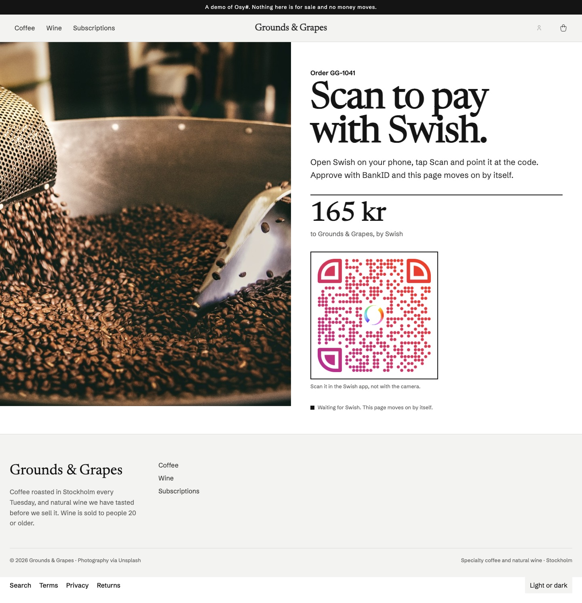
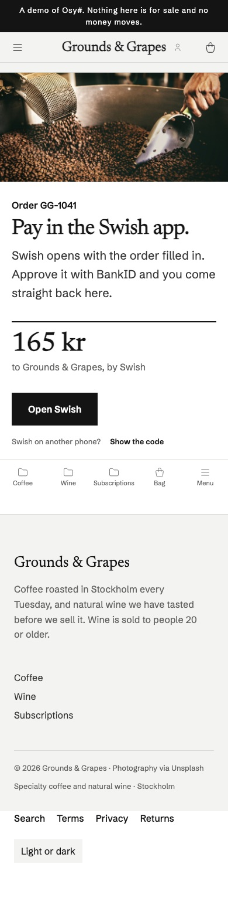
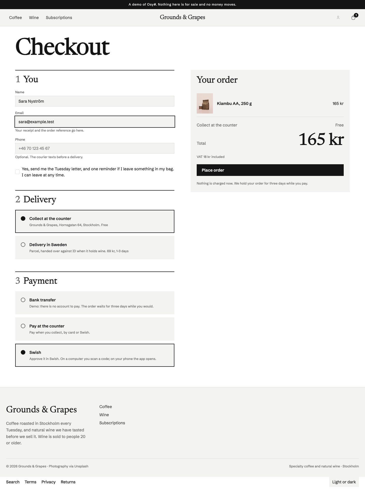

# Osysharp.Payments.Swish — Swish payments, over mutual TLS, in Osy#

Take payment with [Swish](https://www.swish.nu), the phone payment nearly every Swede has: the customer approves in the
Swish app with BankID, and the money is in the shop's bank account in seconds. Payment requests, the status that
follows them, the QR code a computer shows and the link a phone opens, and refunds, written entirely in Osy# over the
public `Http.*` surface.

## Use case

Any app that sells to people in Sweden: a shop's checkout, a café's pre-order page, a booking that takes a deposit, a
club collecting a fee. Swish is what a Swedish customer reaches for first, and it costs the merchant a small fixed fee
rather than a card percentage.

It plugs into `Osysharp.Payments`, so an app that already offers a card or Klarna lists Swish beside them and nothing
that sells changes.



| On a phone the page opens Swish itself | Offered at the checkout once the certificate is set |
|---|---|
|  |  |

*From Grounds & Grapes, a coffee and wine shop built on the shop kit.*

## A certificate, not a key

Swish has no API key. A merchant is whoever holds the TLS client certificate its bank issued for its Swish number,
and every call is made over mutual TLS. This package never sees that certificate: the app grants it the *identity*
with `clientCert`, and the platform presents it on the package's calls.

```osy
// app.osy
app Shop {
  model "**/*.osy";
  use Osysharp.Payments@0;
  use Osysharp.Payments.Swish@0 {
    egress     "cpc.getswish.net";        // Swish
    egress     "mss.cpc.getswish.net";    // the Merchant Swish Simulator, while you build
    egress     "mpc.getswish.net";        // Swish's QR generator (public, no certificate)
    clientCert "SwishCert";               // the merchant certificate, which the package never reads
  }
}

app.Secrets = [ new Secret("SwishCert"), new Secret("SwishCertPassword") ];
```

```console
osy secret set SwishCert --file swish.p12 --base64
osy secret set SwishCertPassword
```

While you build, use the simulator's test certificate and its test number `1234679304`, both published by Swish on
[developer.swish.nu](https://developer.swish.nu). Your bank issues the real certificate once you have a Swish for
merchants agreement. The Swish hosts use a public certificate authority, so no `serverCa` is needed.

## Offer it

```osy
using Osysharp.Payments.Swish;

SwishPayments Swish() {
  return new SwishPayments { SwishNumber = "1231181189",
                             CertificateSet = Security.IsSecretSet("SwishCert") };
}

app.Shop = new ShopSetup { Payments = [ Swish(), /* a card, a transfer… */ ] };
```

Without its certificate Swish is not offered. **Swish moves Swedish kronor only**: for a checkout in any other
currency it is not offered, and says why (`CurrencyRefusal`), which the shop's desk shows beside it.

## How a payment goes

1. **Start.** The kit creates a payment request under an id it derives from the payment's idempotency key (`PUT
   /api/v2/paymentrequests/{id}`), so a retried start is the *same* request to Swish, never a second one.
   - With the customer's mobile number (`PaymentRequest.CustomerPhone`), Swish sends the request to their phone.
   - Without it, Swish answers a token. On the phone that holds Swish your page opens `AppLink(token, returnUrl)`; on a
     computer it shows `QrCode(token)`, drawn by Swish, which the customer scans in the Swish app.
2. **Wait.** `Start` sends the customer to your waiting page (`PayPage`, `/swish/{reference}/{id}/{token}` by
   default). The page asks `Check` every couple of seconds.
3. **Settle.** Swish posts a callback to your payments endpoint when the request is paid, declined, cancelled or has
   failed. **The callback is not signed**, so the kit reads only the id out of it and asks Swish itself, over your
   certificate, how that request stands. A request is Paid only when Swish says so, for *your* Swish number, *this*
   reference and *this* amount in SEK.
4. **Refund.** `Refund` gives back all or part of a paid payment from the bank's own payment reference, with the
   shop's number as the payer, under an id derived from the refund's key. Its status is asked the same way; a refund is
   done at `PAID`, not at `DEBITED`, because the receiving bank can still refuse it.

A request the customer lets time out (three minutes) or declines can be asked again with `Again(id, returnUrl)`, which
asks for exactly what Swish recorded for the old one, so nothing a page passes can change what is paid.

## At a shop's counter

`SwishPayments` is also an `ICounterPayment` (the `Osysharp.Payments` counter contract): list it in the shop's
`CounterPayments` and the till shows Swish's QR code on its own screen for the customer standing there to scan
(`StartAtCounter` — a request with no payer number), asks Swish until it is paid (`CheckAtCounter`, the same check as
`Check`: this number, this reference, this amount), and withdraws it if the sale is called off (`CancelAtCounter`). A
counter payment is refunded like any other Swish payment.

## What is in it

| | |
|---|---|
| `SwishPayments` | the `Osysharp.Payments` provider: start, check, callback, refund, cancel, and the page helpers `QrCode`, `AppLink`, `Again` |
| `SwishClient` | the Commerce API: payment requests v2 (create, read, cancel), refunds v2 (create, read), the QR generator |
| `SwishWire` | the request and response shapes, each field under its Swish name |
| `SwishAmount` · `SwishMessage` · `SwishReference` · `SwishPhone` · `SwishInstructionId` | Swish's own rules applied before Swish has to refuse: kronor with two decimals, a 50-character message in Swish's alphabet, the reference format, a payer's number with its country code, an id Swish accepts |

## Source and tests

Everything is in `model/`, three files of Osy# and no C#.

`tests/` is the producer's own project, every call to Swish stubbed. They cover both ways to start, a
retried start and a retried refund each staying one request, polling to every outcome, a forged callback that says
PAID settling nothing, a paid request for another order, amount or Swish number not counting, refunds and their
callbacks, and the kronor-only refusal. `osy publish` runs them and refuses a version that fails.

To build your own on top of it — another Nordic phone payment, or Swish payouts — fork the folder: the provider is one
class implementing `IPaymentProvider`, and `SwishClient` is ordinary Osy# over `Http.*`.
